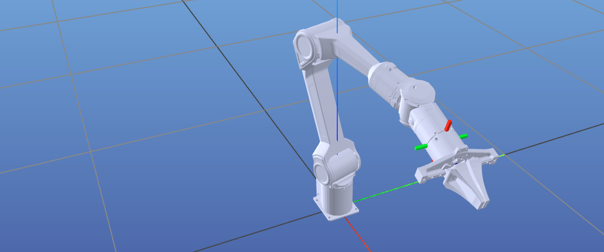

# Piper Development on Jetson

## Prerequisites

1. [astral uv](https://docs.astral.sh/uv/getting-started/installation/)

2. [For Real Robot] install can tool

```bash
sudo apt update && sudo apt install can-utils ethtool
```

## Get started

1. Install dependencies
```bash
uv venv
source .venv/bin/activate
uv pip install -e .
```

## Record demonstration
```bash
# under the virutal env
uv run scripts/record_demonstration.py
##  or 
# python scripts/record_demonstration.py
```
use your mouse to control the device:



